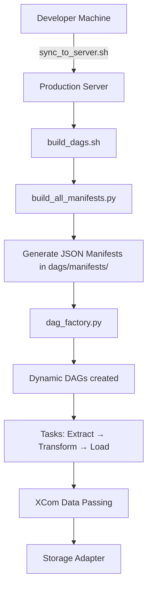

# Architecture Overview

This document describes the high-level architecture of the **Data Airflow Server** project.

---
## 1. Overview

The project follows a **dynamic DAG** approach where:

- DAG definitions are written in human-readable **YAML** files (`dags/configs/`).
- These YAML files are converted into JSON manifests at build time.
- DAGs are generated dynamically at runtime using a central factory (`dag_factory.py`).
- Business logic is implemented using a **class-based service** pattern.

This design allows developers to define pipelines declaratively while keeping complex logic in clean, testable Python code.

---
## 2. High-Level Architecture



### Architecture Flow
```
Step    Component               Description
--------------------------------------------------------------------------------------
1       Developer Machine       Edit YAML manifests and Python services
2       sync_to_server.sh       Syncs code and triggers build on server
3       build_dags.sh           Orchestrates manifest generation and DAG rebuilding
4       build_all_manifests.py  Converts YAML → JSON manifests
5       dag_factory.py          Dynamically creates DAGs from JSON manifests
6       task_wrapper            "Executes services, handles injection and XCom"
7       Services                "ExtractService, TransformService, LoadService"
```

---
## 3. Core Components
### 3.1 Manifest System
```
Component,              Location                                        Role
---------------------------------------------------------------------------------------------------------------------
YAML Source             dags/configs/*.yaml                             Human-editable source of truth
Manifest Builder        src/business_lib/core/build_all_manifests.py    Converts all YAML files to JSON
Manifest Builder Core   src/business_lib/core/manifest_builder.py       Loads and processes individual YAML files
Generated Manifests     dags/manifests/*.json                           Build artifacts (not committed to git)
```

### 3.2 Dynamic DAG Factory

- File: src/business_lib/core/dag_factory.py
- Contains create_dag_from_manifest() and task_wrapper()
- Dynamically creates PythonOperator tasks based on the manifest
- Handles resource injection and XCom data passing between dependent tasks

### 3.3 Business Services (Class-based)
Services are implemented as classes:

- ExtractService
- TransformService
- LoadService

Located in: src/business_lib/services/
Each service:

- Receives dependencies (e.g. storage) via constructor injection
- Is invoked by task_wrapper using the manifest definition

Example from manifest:
``` 
YAML

business_function: ExtractService.extract_data
inject:
  storage: storage
```
---
## 4. Data Flow Between Tasks


task_wrapper automatically:

- Pulls data from upstream tasks using depends_on
- Passes it as the data parameter to the service method
- Pushes the result back to XCom for downstream tasks

---
## 5. Build & Deployment Process

1. Developer edits YAML files in dags/configs/
2. Runs sync_to_server.sh
3. On the server:
   - Files are synced
   - build_dags.sh is executed
   - build_all_manifests.py generates JSON manifests
   - dag_factory.py creates the DAGs

4. Airflow Scheduler loads and runs the new DAGs

---
## 6. Key Design Decisions
```
Decision                    Reason
----------------------------------------------------------------------------------
YAML as source of truth     Easy to read, review, and version control
JSON as generated artifact  Fast loading at runtime, avoids YAML parsing
Class-based services        Better structure, testability, and dependency injection
Dynamic DAG factory         Reduces boilerplate code
XCom for inter-task data    Standard and reliable Airflow mechanism
```

---

## 7. Directory Structure (Key Parts)
```
dags/
├── configs/              # Source YAML manifests (committed)
└── manifests/            # Generated JSON manifests (ignored in git)

src/business_lib/
├── core/
│   ├── dag_factory.py
│   ├── build_all_manifests.py
│   └── manifest_builder.py
└── services/
    ├── extract_service.py
    ├── transform_service.py
    └── load_service.py
```

---
## 8. Future Improvements
Possible next steps:

- Add schema validation for YAML manifests
- Improve error handling and observability in task_wrapper
- Support more complex workflows (branching, conditional logic)
- Add monitoring and metrics for task execution
- Introduce a plugin system for custom services/adapters